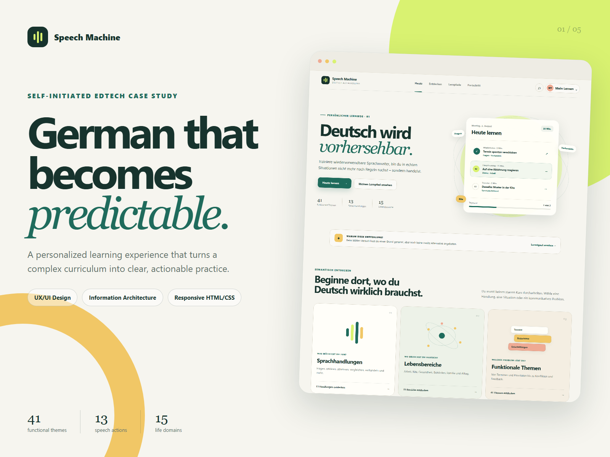
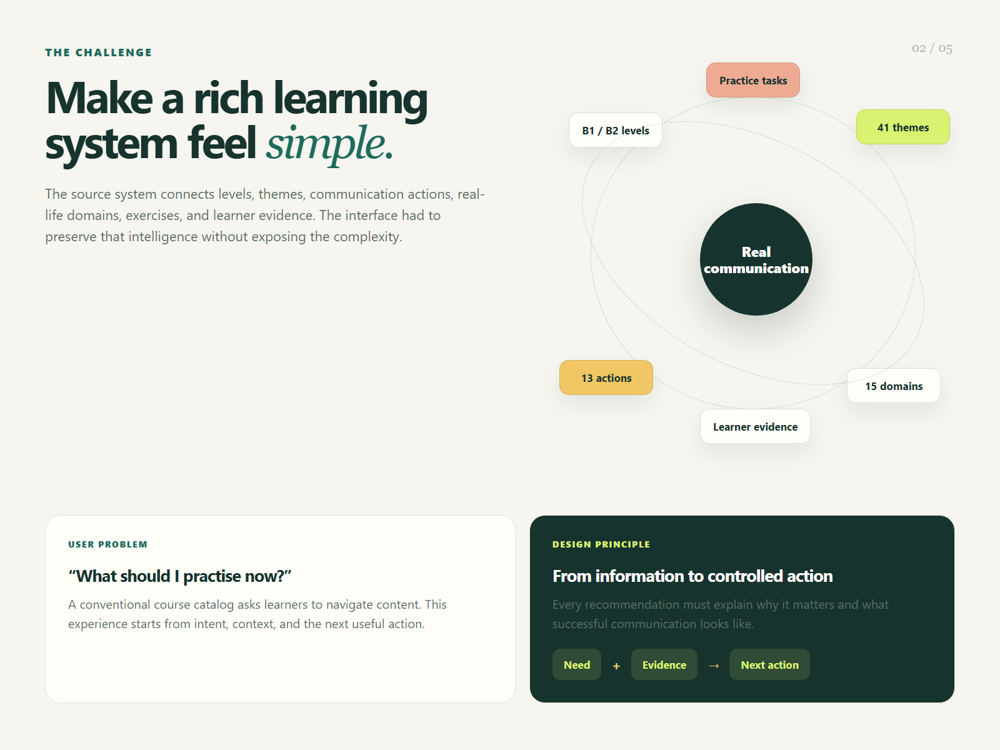
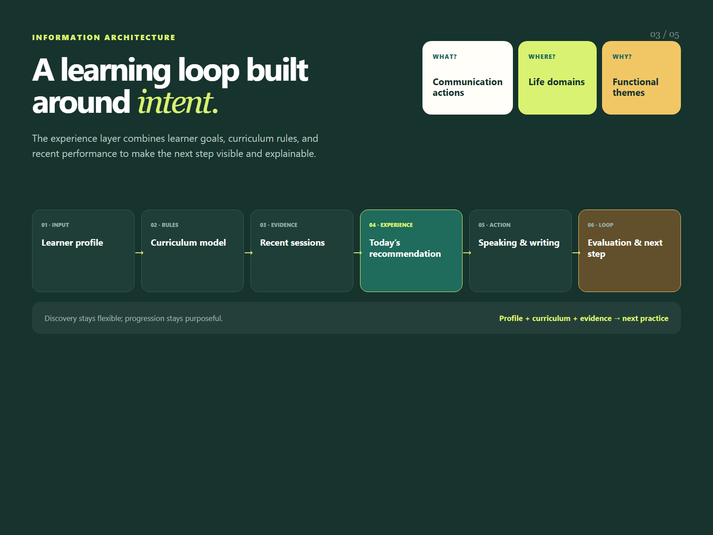
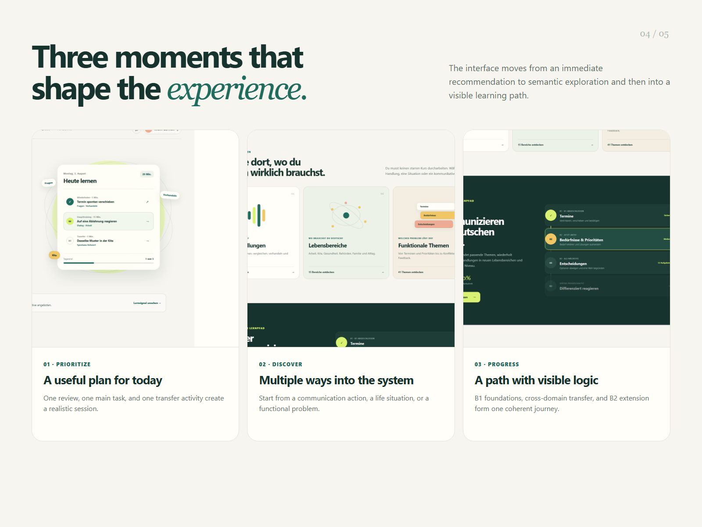
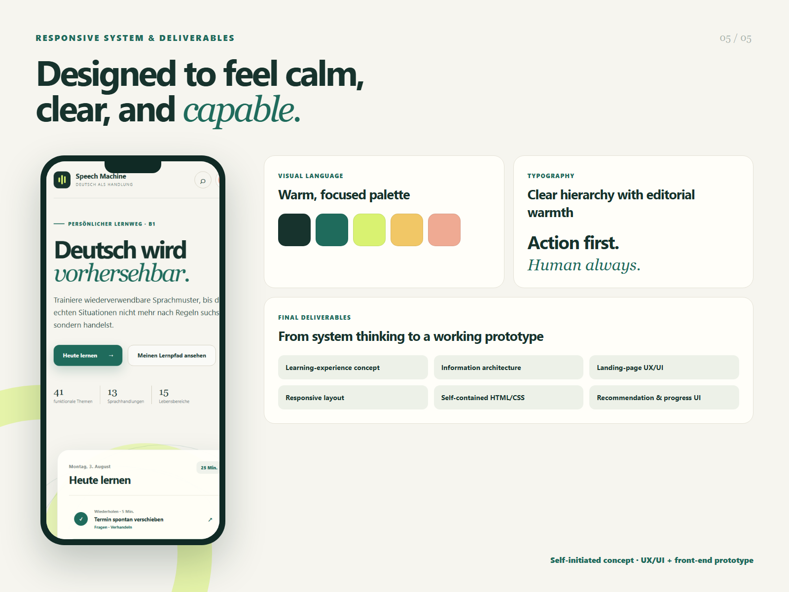

# Speech Machine — EdTech LXP Case Study

A portfolio case study for a personalized German-learning experience platform. The concept turns a complex curriculum and semantic knowledge system into a clear, intent-led learner journey.



## Project overview

**Role:** UX/UI Designer & Front-End Prototyper  
**Type:** Self-initiated EdTech concept  
**Focus:** Learning experience design, information architecture, responsive UI

The source system connects proficiency levels, functional themes, communication actions, life domains, practice tasks, and learner evidence. The interface makes this intelligence useful without exposing the learner to the underlying complexity.

## Design approach

The experience starts from five learner questions:

1. What do I need to practise today?
2. What communicative action do I need?
3. Where will I use German?
4. What should I practise next?
5. Why is the system recommending it?

The result combines a personalized daily plan, explainable recommendations, semantic discovery, goal-oriented B1/B2 learning paths, and progress based on usable communication skills.

## Deliverables

- Learning-experience concept
- Information architecture
- Landing-page UX/UI
- Responsive desktop and mobile styling
- Visual recommendation and progress system
- Interactive portfolio presentation built with React and Vite

## Run locally

```bash
npm install
npm run dev
```

Create the production build with:

```bash
npm run build
```

## Case-study gallery

| Challenge | Information architecture |
| --- | --- |
|  |  |

| Experience | Deliverables |
| --- | --- |
|  |  |

---

Self-initiated concept · UX/UI design + front-end prototyping
